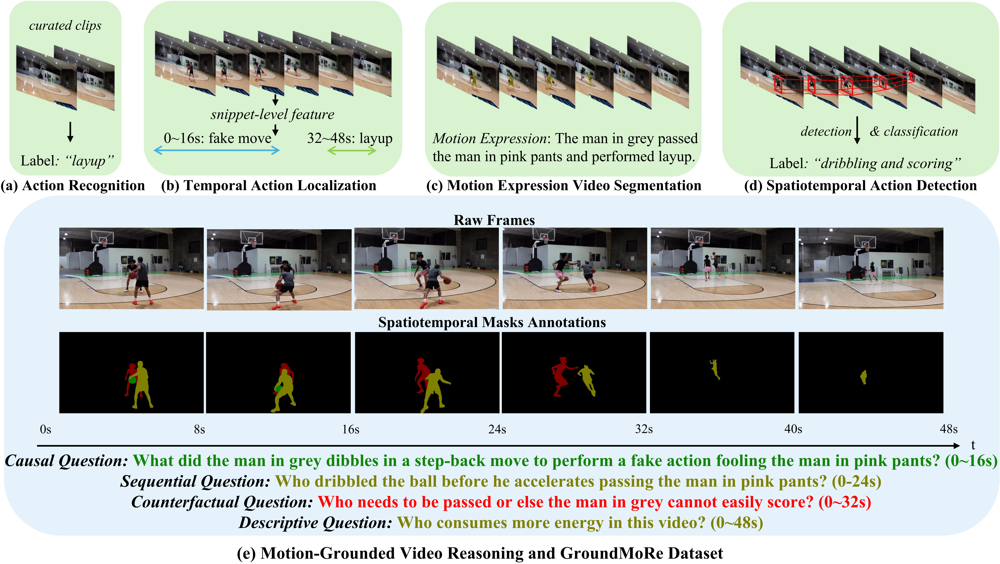
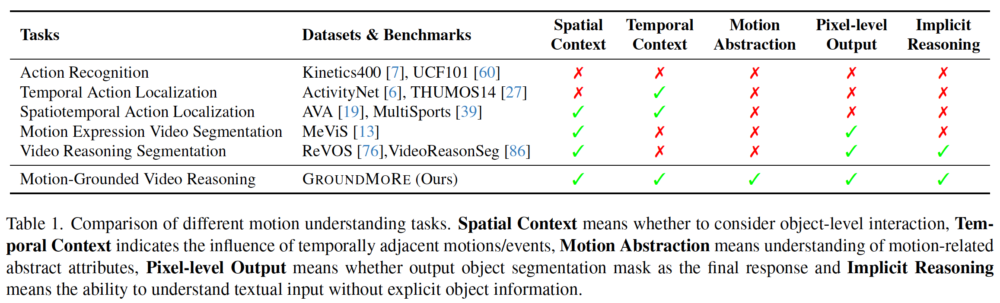
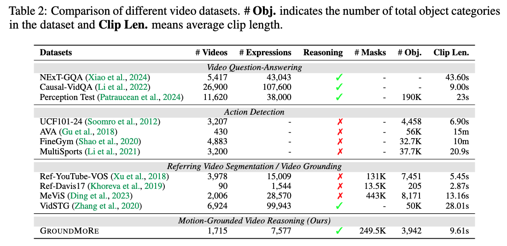
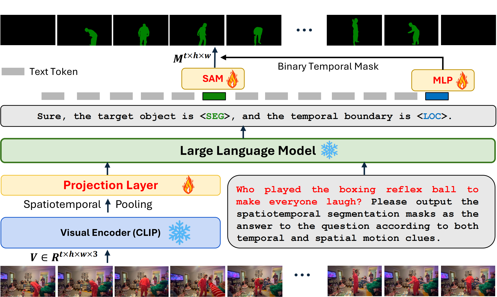
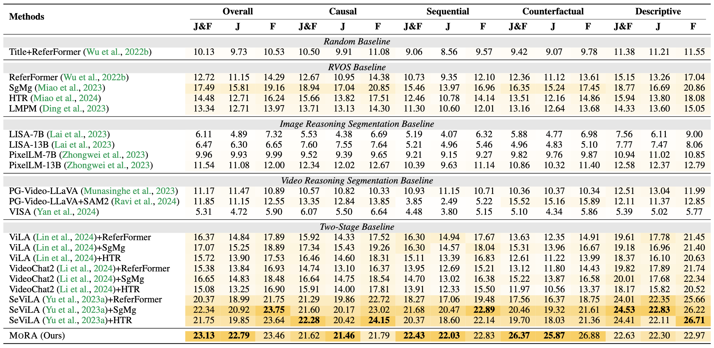
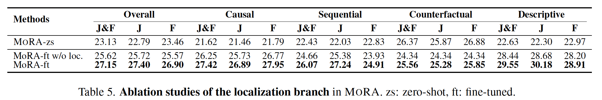

# Motion-Grounded Video Reasoning: Understanding and Perceiving Motion at Pixel Level

**[CVPR 2025]**  
[[Project Page](https://groundmore.github.io)] [[Paper](assets/GroundMoRe_CVPR2025_Camera_Ready.pdf)] [[Supp](assets/GroundMoRe_CVPR2025_Supp.pdf)] [[Dataset](https://huggingface.co/datasets/groundmore/GroundMoRe/tree/main)]

<!--  -->

---

## 🧠 Overview

We introduces a new task: **Motion-Grounded Video Reasoning**, where models must answer motion-related questions using **spatiotemporal segmentation masks** as visual responses.

This task addresses key limitations in prior video understanding research by introducing:
- ❓ Implicit question-based reasoning  
- 🕒 Motion-aware temporal localization  
- 🧍 Object-level visual grounding  
- 🎯 Pixel-level mask generation across time  
- 🧩 Four question types: **Causal**, **Sequential**, **Counterfactual**, and **Descriptive**

---

## 📌 Comparison to Prior Tasks


> **Figure 1**: GROUNDMORE fills the gap between referring segmentation, temporal grounding, and reasoning by combining implicit QA with visual spatiotemporal output.

---

## 📋 Task Definition

The **Motion-Grounded Video Reasoning** task requires models to:

- **Input**:  
  - A video clip `V ∈ ℝᵗˣʰˣʷˣ³`  
  - A motion-related question `Q`

- **Output**:  
  - Spatiotemporal segmentation masks `M ∈ ℝᵗ′ˣʰˣʷ` highlighting the target object

This output represents the reasoning result **visually** by grounding the answer over space and time.

---

## 🧪 Dataset Details

We collect a new benchmark dataset: **GROUNDMORE**, designed to evaluate fine-grained motion reasoning.

- **1.7K** high-resolution video clips  
- **7.6K** question-answer pairs  
- **249K** object-level spatiotemporal masks  
- Diverse video categories: family scene, animal, ball game, and outdoor activity

---

### ✔️ Task Coverage Comparison



> **Table 1**: Motion-Grounded Video Reasoning supports all dimensions: spatial & temporal context, motion abstraction, pixel-level output, and implicit reasoning.

---

### 📊 Dataset Statistics



> **Table 2**: GROUNDMORE contains more dense QA + segmentation annotations than prior benchmarks, especially in motion-related reasoning.

---

## 🧠 MoRA: Motion-Grounded Reasoning Assistant

We propose a baseline model called **MoRA**, built for this task. It integrates:

- **LLaVA** for multimodal reasoning  
- **SAM** decoder for spatial mask decoding  
- **[SEG] token** for object semantic embedding  
- **[LOC] token** for temporal localization of motion events  
<!-- - **Spatiotemporal pooling** from video transformer encoders   -->

---

### 🧱 Model Architecture



> **Figure 3**: MoRA outputs pixel-level segmentation masks as response for the input motion-related question.

---

## 📈 Results on GROUNDMORE

### 🥇 Zero-shot Evaluation



> **Table 3**: MoRA achieves SOTA on all question types, outperforming previous baseline models.

---

### 🔍 Ablation Study



> **Table 5**: Temporal localization via [LOC] token significantly improves performance.

---

## ⚙️ Installation

```bash
git clone https://github.com/groundmore/GROUNDMORE.git
cd GROUNDMORE
conda create -n groundmore python=3.10
conda activate groundmore
pip install -r requirements.txt
```


---

## 🚀 Usage

### Training
Before training, you need to obtain [LISA](https://huggingface.co/xinlai/LISA-7B-v1/tree/main) and [SAM](https://dl.fbaipublicfiles.com/segment_anything/sam_vit_h_4b8939.pth) for model initialization.

### Zero-Shot Training
We use [Refer-YouTube-VOS](https://youtube-vos.org/dataset/vos/), [MeViS](https://github.com/henghuiding/MeViS) dataset for zero-shot training.

```
bash run.sh
```

### GroundMoRe Training Set Finetuning
Coming soon.

### GroundMoRe Evaluation

```bash
python evaluate_groundmore.py
```


---

## 📣 Citation

If this work is useful for your research, please cite:

```bibtex
@inproceedings{deng2025groundmore,
  title={Motion-Grounded Video Reasoning: Understanding and Perceiving Motion at Pixel Level},
  author={Deng, Andong and Chen, Tongjia and Yu, Shoubin and Yang, Taojiannan and Spencer, Lincoln and Tian, Yapeng and Mian, Ajmal Saeed and Bansal, Mohit and Chen, Chen},
  booktitle={Proceedings of the IEEE/CVF Conference on Computer Vision and Pattern Recognition (CVPR)},
  year={2025}
}
```
